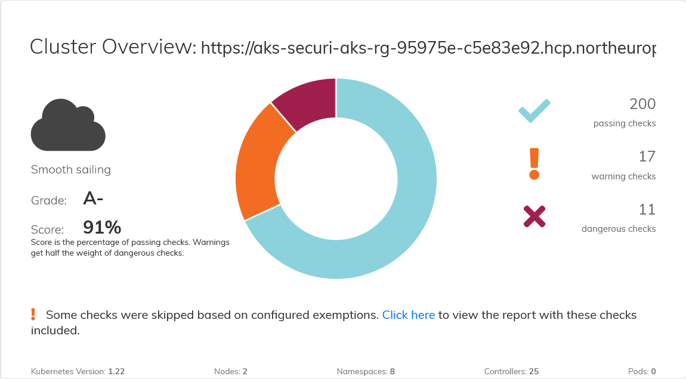

Create namespace demo

```
kubectl apply -f namespace-demo.yaml
```

Apply application manifests into k8s cluster

```
kubectl apply -R -f manifests -n demo 
```

```
kubectl get all,ep -n demo
```
<pre>

</pre>



